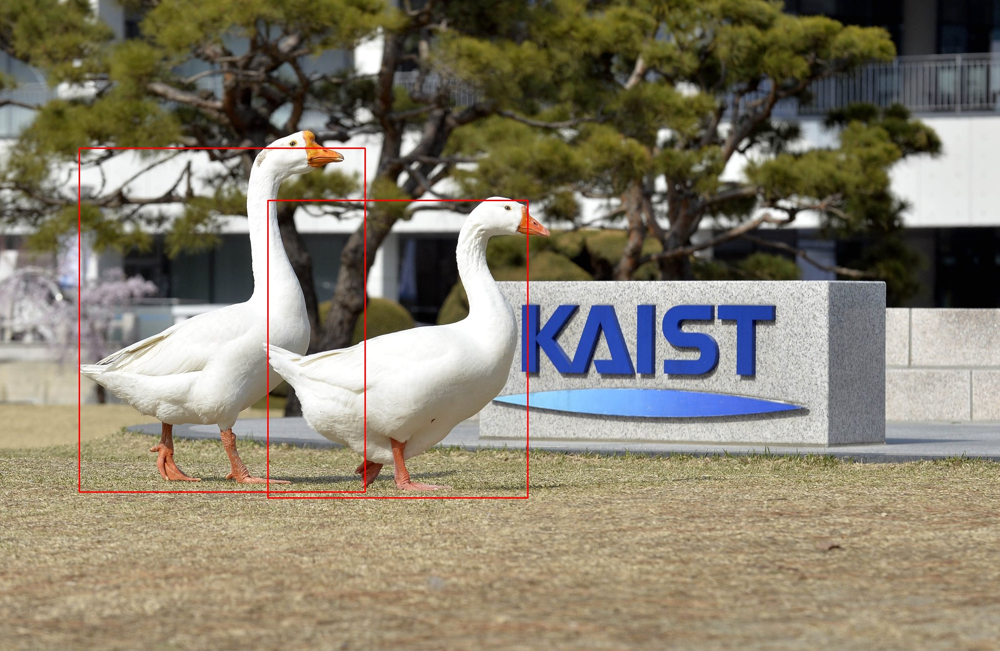

# TF-TRT_Object_detection

<p align="center">

</p>

This repository contains scripts to convert Tensorflow checkpoint file to TensorRT graph and to inference Object Detection Network using Tensorflow-TensorRT graph.

<a name="Usage"></a>
Usage
-----

## Directory Structure
```
+tf-trt_object_detection
  + model
    - pipeline.config
    - model.ckpt.data
    - model.ckpt.index
    - model.ckpt.meta
  - trt_make.py
  - trt_inference.py
  - graph_utils.py
```

## Convert checkpoint file to TF-TRT graph
The following command converts the `ckpt` and `config` files in the model folder to TF-TRT graph optimized for FP16 precision. The converted file is saved as trt_graph.pb in the model folder.
```
python trt_make.py
```
You can select the precision mode between FP32, FP16, and INT8.
And change the threshold to the appropriate value for the application.

```python
## Initialize variables.
OUTPUT_DIR = os.getcwd()
PRECISION_MODE_LIST = ["FP32","FP16","INT8"]

PRECISION_MODE = PRECISION_MODE_LIST[1]
SCORE_THRESHOLD = 0.7

CONFIG_PATH = os.path.join(OUTPUT_DIR, 'data', 'pipeline.config')
CKPT_PATH = os.path.join(OUTPUT_DIR, 'data', 'model.ckpt')
GRAPH_PATH = os.path.join(OUTPUT_DIR, 'data', 'trt_graph.pb')
```

## Inference Object detection using TF-TRT graph
If you create a tf-trt graph using the `trt_make.py`, you can find the `trt_graph.pb` in the model folder. Copy the input image file `image.jpg` in the model folder. `trt_inference.py` inference the input image file using the SSD-inception-v2 model trained with the COCO dataset and saves the result.
```
python trt_inferernce.py
```
